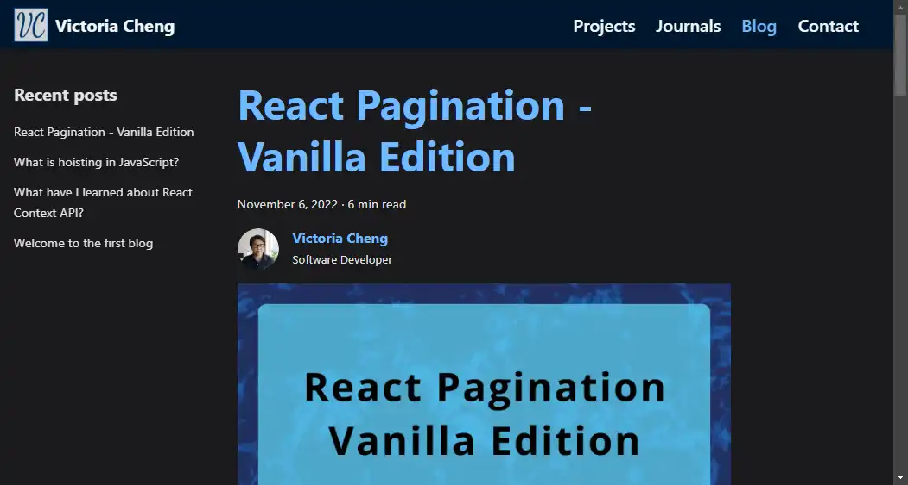
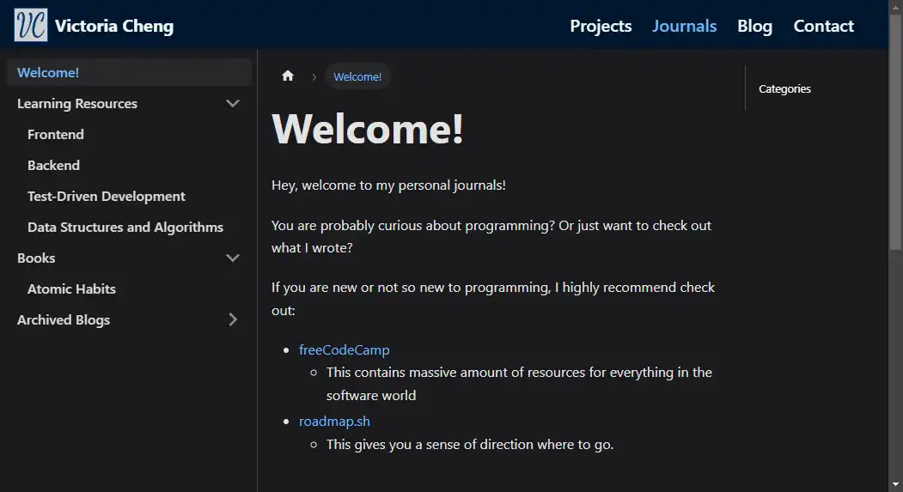

# Website

This is a personal website that contains my information, projects, journals and blog.

- [Website](#website)
  - [Tech Stack](#tech-stack)
  - [Screenshot](#screenshot)
  - [Site layout](#site-layout)
  - [Tools](#tools)

## Tech Stack

- [Docusaurus 2](https://docusaurus.io/), a modern static website generator
- TypeScript
- React
- CSS module
- Markdown
- [Mermaid Diagrams](https://mermaid-js.github.io/mermaid/#/)

## Screenshot

**Home**

| Blog | Journals |
|:--:| :--: |
||  |

## Site layout

- Home page
  - Greeting
  - About me
  - Facts
  - Skills
- Projects
  - Projects that I have worked on
- Journals
  - Welcome
  - Learning Resources
  - Books
  - Archived blogs
- Blog
  - I share knowledge that I have learned

## Tools

- [Sqooush app](https://squoosh.app/)
  - It is an image compression tool that reduce image sizes
    - formats: webp, png, jpeg
