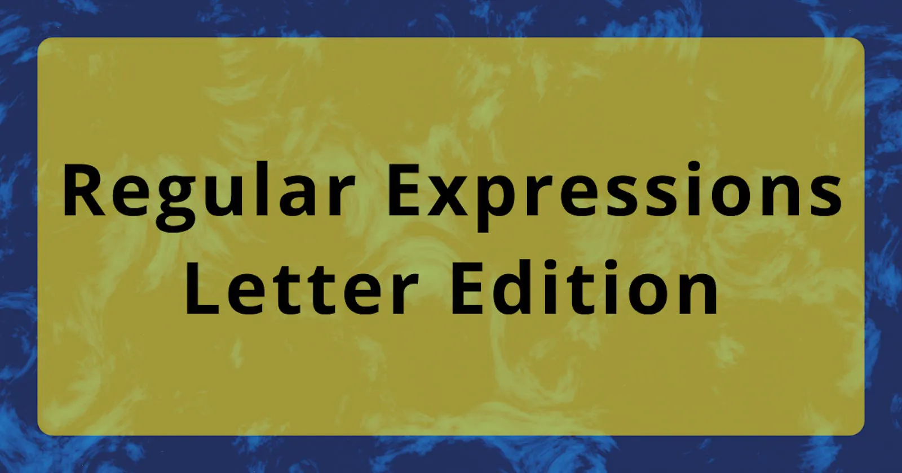

<!--truncate-->

## 😬 What is Regular Expression? 😬

**Archived blogs from [here](https://victoriacheng15.hashnode.dev/regular-expressions-letter-edition)**

What is regular expressions? They are patterns that used to match characters in provided strings.

When I first looked into this, and it looks so scary! Since I do codewars daily, and I encountered a lot of solutions that are solved with this. I almost to pull my hair out! However, each problem tends to focus on one type of regular expression.

In general, regular expressions tend to wrap with 2 forward slashes.

👉 /pattern/g 👈

`g` is one of the expression flags and stands for `global`. Regular expressions only search for a single match by default. `g` enables to search more than 1 match.

e.g.

- If you want to find all upper cases, the pattern is `/[A-Z]/g`
- If you want to find all lower cases, the pattern is `/[a-z]/g`
- If you want to find both lower and upper cases, the pattern is `/\w/g`
- If you want to find all non-letters, the pattern is `/\W/g`

When you only focus on one type at a time, it is not so overwhelmed. So I am slowly learning about it little by little over time. In the end, it is not bad after all. And it can be really powerful and useful once you get it.

## Codewars problems:

### First problem

Write a function that takes a single string (word) as argument. The function must return an ordered list containing the indexes of all capital letters in the string.

Example:

Test.assertSimilar( capitals('CodEWaRs'), [0,3,4,6] );

👣 Steps:

- set regex for capital letters
- use indexOf() to find captial letters' indexs

```js
const capitals = (word) => {
  const regex = /[A-Z]/g;
  const capIndex = (char) => word.indexOf(char);
  return word.match(regex).map(capIndex);
};
```

### Second problem

Return the number (count) of vowels in the given string. We will consider a, e, i, o, u as vowels for this Kata (but not y).
The input string will only consist of lower case letters and/or spaces.

👣 Steps:

- set up aeiou regex
- check for match
- if true, return length, otherwise return 0

```js
function getCount(str) {
  const vowels = /[aeiou]/gi;
  const checkMatch = str.match(vowels);
  return checkMatch !== null ? checkMatch.length : 0;
}
```

`i` is also one of the expression flags, `i` stands for ignore, which mean it will ignore the case of the letter.

Example: `/aBc/i` would match `AbC`.

# Resources

[MDN - Regular expressions](https://developer.mozilla.org/en-US/docs/Web/JavaScript/Guide/Regular_Expressions)

[RegExr: Learn, Build, & Test RegEx](https://regexr.com/)

[regex101: build, test, and debug regex](https://regex101.com/)

# Thank you!

Thank you for your time and reading. I hope this helps you. Please feel free to let me know if you have any questions or feedback. 😀
