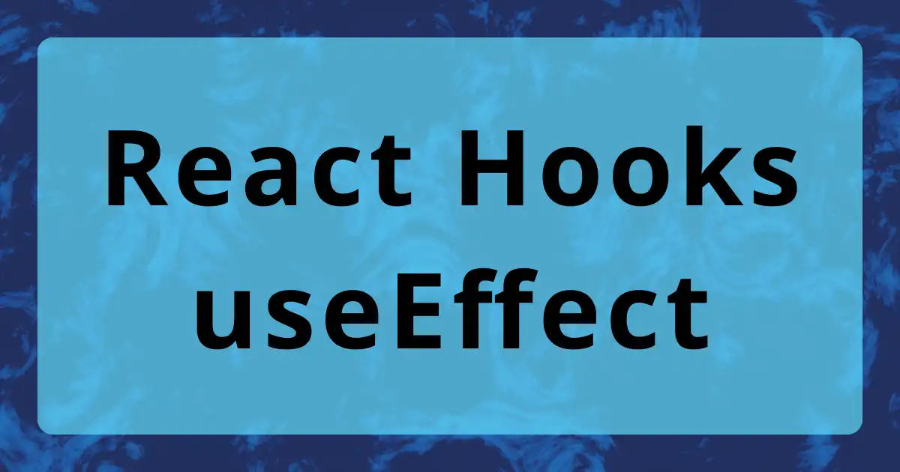

What is the useEffect Hook in React?

<!--truncate-->

## What is useEffect?

It is a tool in React that allows developers to perform side effects in function components. The hook is called every time a component is rendered, including the first time the component is rendered. It allows developers to perform wide range of tasks, such as `fetching data`, `setting up event listeners`, and `modifying the DOM`.

This is useful for a wide range of tasks, such as fetching data, setting up event listeners, and modifying the DOM.

The most common example would be fetching data from API, and it usually looks like below.

```js
import { useEffect, useState } from "react";

function App() {
  const [data, setData] = useState([]);
  const [loading, setLoading] = useState(true);
  const [error, setError] = useState(null);

  useEffect(() => {
    const fetchData = async () => {
      try {
        const res = await fetch("https://my-api.com/data");
        const data = await res.json();
        setData(data);
      } catch (error) {
        setError(error);
      }
      setLoading(false);
    };

    fetchData();
  }, []);

  if (loading) return <p>Loading...</p>;
  if (error) return <p>{error.message}</p>;

  return (
    <div>
      {data.map((item) => (
        <p>{item.name}</p>
      ))}
    </div>
  );
}
```

You also may see `then()` and `catch()` instead.

```js
useEffect(() => {
  fetch("https://my-api.com/data")
    .then((response) => response.json())
    .then((data) => setData(data));
    .catch((error) => setError(error))
}, []);
```

## What is the dependency array?

```js
useEffect(() => {
  // Perform some side effect
}, []); // <-- see this array
```

This hook accepts 2nd argument, which is the dependency array. It is to control when the hook is called.

> **If the array is empty like the example above, it will only called once when the component is first rendered.**

### Both hooks has a value in their own array

Let's what will happen if there are two useEffect hooks with different values in the array.

```js
useEffect(() => {
  // Perform some side effect
}, [value1]);

useEffect(() => {
  // Perform some side effect
}, [value2]);
```


Both hooks were running every time the count value is changed.

### One hook has both values in the array

Let's see what happen if the first useEffect has `value1` and `value2` while the 2nd useEffect has `value2`.

```js
useEffect(() => {
  // Perform some side effect
}, [value1, value2]);

useEffect(() => {
  // Perform some side effect
}, [value2]);
```


Notice when I clicked the 2nd button, both useEffects were called? It is because the first useEffect has `count` and `count1` in its dependency array

### The 2nd hook doesn't have an array

Let's see what happen if the first useEffect has a value in the array while the 2nd useEffect doesn't have an array?

```js
useEffect(() => {
  // Perform some side effect
}, [value1]);

useEffect(() => {
  // Perform some side effect
});
```


As you can see, clicking the first button, both useEffects were called. Imagine this as a huge app that do many things, the useEffect without an empty array will run on _every render_. Action A will run the useEffect. Action B will run the useEffect as well. And more actions will rnu the useEffect! This will have many unnecessary renders and cause performance issues.


My rule of thumb is always add an empty array in the useEffect. At least, you can know and make sure the component will only run once after the initial render.

### Test Code

This is the code that I wrote for this blog. If you are interested in playing around with useEffect hook, click the box below.

<details>
<summary>Code</summary>

```js
import { useEffect, useState } from "react";
import "./App.css";

function App() {
  const [count, setCount] = useState(0);
  const [count1, setCount1] = useState(0);

  function handleClick() {
    setCount((prev) => prev + 1);
  }

  function handleClick1() {
    setCount1((prev) => prev + 5);
  }

  useEffect(() => {
    console.log(`the count: ${count}`);
  }, [count]);

  useEffect(() => {
    console.log(`the count1: ${count1}`);
  }, []);

  return (
    <main>
      <h1>Hello</h1>
      <p>count: {count}</p>
      <p>count1: {count1}</p>
      <button type="button" onClick={handleClick}>
        click for count
      </button>
      <button type="button" onClick={handleClick1}>
        click for count1
      </button>
    </main>
  );
}

export default App;
```

</details>

## Build your own hook

You can also define your hooks in separated files. These files should be in the `hooks` folder. The file name usually start with `use` with a description. e.g. `useFetchApi` or `useFetchData` or similar naming convention.

A couple of advantages:

- Call the hook in a specific component that need the fetched data
- Less visual clutter for the component file
- Reuseable

It is very similar on how would you write in the App or other component. Instead of return the component structure, return the fetched information. And the file path should look like `src/hooks/useFetchApi.jsx`

```js
import { useEffect, useState } from "react";

const useFetchApi = () => {
  const [data, setData] = useState([]);
  const [loading, setLoading] = useState(true);
  const [error, setError] = useState(null);

  useEffect(() => {
    const fetchData = async () => {
      try {
        const res = await fetch("https://my-api.com/data");
        const data = await res.json();
        setData(data);
      } catch (error) {
        setError(error);
      }
      setLoading(false);
    };

    fetchData();
  }, []);

  return { data, loading, error };
};

export default useFetchApi;
```

Go to the component and write codes below.

```js
import useFetchApi from "../hooks/useFetchApi";

function Something() {
  const { data, loading, error } = useFetchApi()

  return (
    // render the page with fetched information!
  )
}

export default Something;
```

## Resources

- [React docs - useEffect](https://beta.reactjs.org/apis/react/useEffect)
- [How the useEffect Hook Works (with Examples)](https://daveceddia.com/useeffect-hook-examples/)

## Thank you!

Thank you for your time and reading this!
