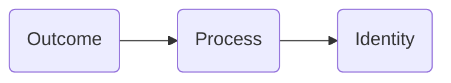
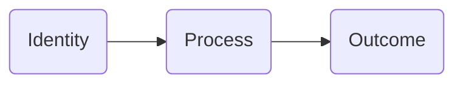
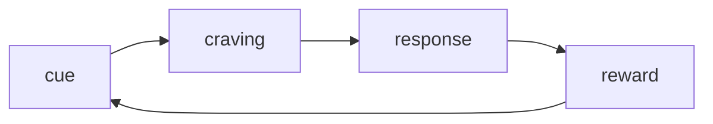

> Atomic Habits: An Easy & Proven Way to Build Good Habits & Break Bad Ones

Author: [James Clear](https://jamesclear.com/atomic-habits).

**Personal note:**

So far, I have read a couple of chapters and I even re-read some chapters to see if I miss anything or not. This book is a very well written guide on how to change your habits and get 1% better every day. I have gotten ideas on why good habits doesn't stay with you, while bad habits area always staying with you. This book also opens up my mind and see things differently.

**I definitely highly recommended purchasing this book.**

Remember, "Rome was not built in one day". It takes time to understand and master something like skill, habit, etc. I am resonated with this [newsletter](https://jamesclear.com/lay-a-brick) a lot

## Chapter 1

The author described change is slow very well by using ice cube as the example. Imagine the ice cube is on the table with temperature of 25 degrees. No change on the ice cube and temperature is slowly increasing by 1 degree. Nothing happens at 26 degrees. 27 degrees, 28, 29, 30, 31 and still nothing happens. Until 32 degree, the ice cube is begins to melt. As you can see 1 degree shift, it doesn't show any difference, but until it reaches to a point where it will unlock a huge change. In short, to building a good habit, it takes time.

> There is a phrase, "Roman wasn't built in a day"

- Forgot about goals, focus on systems instead for better results.
- Habits are like the atoms of our live.
- Getting 1 percent better every day counts for a lot in the long term.
- Habits are a double-edged sword. They can **work for** or **against** you.
- Small changes often appear to make no difference until you reach a certain threshold.

## Chapter 2

Changing habits is challenging for two reasons, 1)we try to change the wrong thing and we try to change our habits in the wrong way.

Three layers of behavior change:

- First: change your outcomes
  - Like change result: weight loss, publish books, etc
    - Associate with goals
- Second: change your process
  - Like change result: implement a new route, decluttering desk
    - Associate with habits
- Third: change your identify
  - Like change beliefs: worldview, self-image, judgement
    - Associate with beliefs, assumptions, biases

Outcomes are what you get. Processes are what you do. Identify is what you believe.

**Outcome-based habits:**

**Identity-based habits:**

> You have a new goal and a new plan, but you have not changed who you are.
>
> By James Clear

Identity change process:

- Decide the type of person you want to be
- Prove it to yourself with small wins.

In order to make change and build up good habits, go deep to the core aka the identity. Believe that you are `insert your identity` and ask yourself what would `identity` person would do? Then work and build up from there.

e.g. If you want to be a healthy person, ask yourself `what would a healthy person?` do in certain situations and then use this as a guide to lead you.

## Chapter 3

A habit is a behaviour that has been repeated enough times to become automatic.

The process of building a habit can be divided into 4 steps: cue, craving, response, and reward.

The cue triggers your brain to initiate a behaviour.
The cravings are the motivational force.
The response is the actual habit you perform.
The reward is to satisfy your craving and teach us.

Let's say, the room is dark (_the cue_) and you can't see anything. But you want to see everything (_the craving_). So you look for a flip switch (_the response_). Once the flip switch is found, turn on the light (_the reward_). This is one of the simplest example that we are doing it often enough to become automatic.

**The habit loop:**

## Chapter 4

Before we can effectively build new habits, we need to get a handle on current ones. This could be challenging. There is a process called pointing and calling that calling out certain things and raise the awareness.

The more automatic a behaviour becomes, the less likely we are to consciously think about it.

Get to the habit scorecard. You write down what are your daily activities in order from wake up to sleep. Once the list is written and look at each of them. 

- Write `+` if it is a good habit. 
- Write `-` if it is a bad habit.
- Write `=` if it is a neutral habit.

**A list of habits:**
- Turn off alarm --> =
- Check the phone --> -
- Drink a cup of water --> +
- Go to bathroom --> +
- Eat breakfast --> +
- Open up computer --> +
- and more
  
If it is difficult to determine how to rate certain habits, ask yourself Does this behaviour help me become the type of person I wish to be? and/or Does this habit cast a vote for or against my desired identity? Also, using the `point and call` process to raise the awareness on what are you about to do.

- Good habits --> positive outcome
- Bad habits --> negative outcome

## Chapter 5