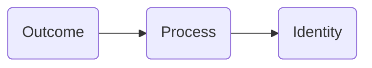
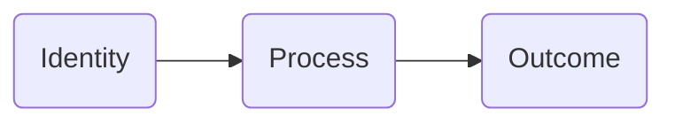

> Atomic Habits: An Easy & Proven Way to Build Good Habits & Break Bad Ones

Author: [James Clear](https://jamesclear.com/atomic-habits).

## Chapter 1

The author described change is slow very well by using ice cube as the example. Imagine the ice cube is on the table with temperature of 25 degrees. No change on the ice cube and temperature is slowly increasing by 1 degree. Nothing happens at 26 degrees. 27 degrees, 28, 29, 30, 31 and still nothing happens. Until 32 degree, the ice cube is begins to melt. As you can see 1 degree shift, it doesn't show any difference, but until it reaches to a point where it will unlock a huge change. In short, to building a good habit, it takes time.

> There is a phrase, "Roman wasn't built in a day"

- Forgot about goals, focus on systems instead for better results.
- Habits are like the atoms of our live.
- Getting 1 percent better every day counts for a lot in the long term.
- Habits are a double-edged sword. They can **work for** or **against** you.
- Small changes often appear to make no difference until you reach a certain threshold.

## Chapter 2

Changing habits is challenging for two reasons, 1)we try to change the wrong thing and we try to change our habits in the wrong way.

Three layers of behavior change:

- First: change your outcomes
  - Like change result: weight loss, publish books, etc
    - Associate with goals
- Second: change your process
  - Like change result: implement a new route, decluttering desk
    - Associate with habits
- Third: change your identify
  - Like change beliefs: worldview, self-image, judgement
    - Associate with beliefs, assumptions, biases

Outcomes are what you get. Processes are what you do. Identify is what you believe.

**Outcome-based habits:**

**Identity-based habits:**

Let's say two people resisting a cigarette. When offer a cigarette, person A says `No, thanks. I am trying to quit` while person B says `No thanks. I am not a smoker`. Both responds differently, but first is outcome based while second is identity based.

> You have a new goal and a new plan, but you have not changed who you are.
>
> By James Clear

Identity change process:

- Decide the type of person you want to be
- Prove it to yourself with small wins.

In order to make change and build up good habits, go deep to the core aka the identity. Believe that you are `insert your identity` and ask yourself what would `identity` person would do? Then work and build up from there.

e.g. If you want to be a healthy person, ask yourself `what would a healthy person?` do in certain situations and then use this as a guid to lead you.

## Chapter 3
